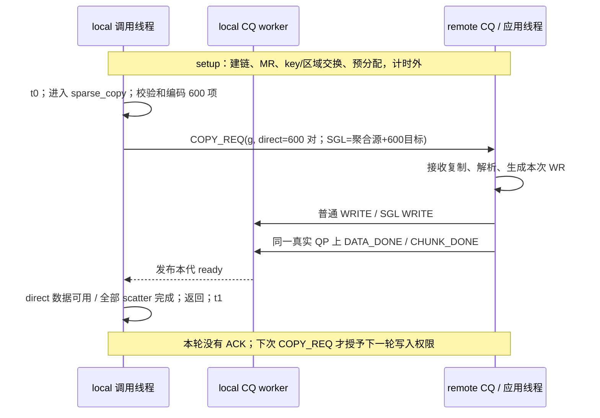

# ubs-comm：local 发起的 sparse_copy 性能穿刺设计

更新：2026-09-12。阶段 1 已在 `main@38e6637` 之上的未提交工作区实现，目标 Linux/AArch64 构建与 RDMA 验证仍为 HW_PENDING；阶段 2/3/4 仍是设计。依赖保持 ubs-comm `oneside-msge-merge@9e4c035a5d68ccca02d05fade3b6f5907db24ef4`，本次未修改该依赖或其它 worktree。

实施步骤见 [IMPLEMENTATION_PLAN_CN.md](IMPLEMENTATION_PLAN_CN.md)，当前 v3 命令见 [README.md](README.md)。历史阶段 1.5 报告不再定义新协议。

## 1. 唯一主口径：local 调用到 local 数据可用

固定角色：**local 是调用者、数据接收者和最终内存拥有者；remote 是源数据提供者、RDMA WRITE 发起者**。旧 receiver 对应 local，旧 sender 对应 remote。

一次同步 `sparse_copy` 包含：

1. local 校验并编码本次地址描述，向 remote 发送完整请求。direct 基线必须携带 600 个源/目标地址对；后续 SGL 模式允许用更少的聚合源描述符配 600 个目标地址。
2. remote 接收、解析请求，按请求地址构造并提交 600 个 1 KiB 数据的传输。
3. local 确认最终 dst 可用；SGL 组还要完成所有 chunk 的 scatter，然后返回。

local 使用自己的单调时钟，在函数调用前开始、返回后结束。包含请求编码/传输/解析、数据传输、完成通知处理、scatter，以及各环节的背压和线程交接。**删除逐轮 local→remote 的 ROUND_ACK，不新增请求确认 Reply。** remote→local 的数据完成通知仍必需，普通 WRITE 本身不通知 local 应用数据可用。



这是完整应用接口的性能，不是纯 NIC 峰值。只允许每 session 一次调用在途，不实现跨轮窗口、异步 sparse_copy、通用内存池或自动重连。

## 2. 旧基线差距与阶段 1 当前落点

| 项目 | main@38e6637 旧实现 | 当前 v3 实现 |
|---|---|---|
| 发起点 | RunSenderRound：remote 自主循环 | local 每次发 COPY_REQ，remote 只响应请求 |
| 地址 | BuildPutRequests 在 setup 固定生成 `src+i*4096 → dst+i*4096` | direct 每次发送 600 对偏移；SGL 可发送聚合源描述符和 600 个目标偏移，remote 按本次请求重新填 WR/iov |
| 计时 | remote 首次 Put 前至 ACK 和本地 callbacks 完成 | local 调用入口至最终 dst 可用并返回 |
| 请求开销 | 无逐轮地址请求 | 校验、编码、Send、remote 接收和解析全部计入 |
| 完成 | ROUND_READY 后回 ROUND_ACK | DATA_DONE/CHUNK_DONE 保留，逐轮 ACK 删除 |
| 消息容量 | SetupService 的 maxSendRecvDataSize=1024 | 改为 16384，验证完整请求 Send 路径 |
| baseline | 600 次异步 Put 直接写分散 dst，无 scatter | 保持 direct，不加入 staging/scatter |
| 驱动与结果 | sender 驱动、输出性能 JSON | local 驱动、输出；remote 输出状态/诊断 |
| 阶段 1.5 | A+B 已落地 | 按新的线程所有权复用，不能保留旧 ACK 协议 |

不能只挪计时语句或删 SendRoundAck。请求驱动、描述符来源、复用条件和退出流程要一起调整。旧 `e2e_us` 与新 `sparse_copy_us` 不能直接相减来估算 ACK 或请求开销。

## 3. API、输入与请求 wire

### 3.1 最小 API 和计时边界

以下为伪代码，真正实现要匹配当前 hcom 类型和所有权。

```cpp
struct CopyEntry { uint64_t remote_src_offset; uint64_t local_dst_offset; }; // direct: 恰好 600 对
// session 已有连接/MR/key，模式在 setup 确定；每项固定 1024 字节。
// direct entries 恰好 600 项；同一 session 不可并发调用。
Status sparse_copy(Session& session, Span<const CopyEntry> entries);

// 阶段 3 扩展输入视图；remote_source_descriptors 的含义由 source_format 决定。
struct SglCopyInput {
    SourceFormat source_format; // SPARSE_600 或 GROUPED
    Span<const uint64_t> remote_source_descriptors; // 600 个源偏移，或真实源组描述符
    Span<const uint64_t> local_dst_offsets;         // 始终 600 个目标偏移
    uint16_t sgl_items;                             // 8 / 16 / 30
};
Status sparse_copy(Session& session, const SglCopyInput& input);

Session s = SetupAndExchange(config);            // 不计时
PrepareSourceAndCallerInputLists(s);             // 不计时
samples.reserve(rounds);                         // 不计时
wall_begin = LocalMonotonicRawNow();
for (...) {
    const auto& entries = caller_lists[next_list];
    auto t0 = LocalMonotonicRawNow();
    Status rc = sparse_copy(s, entries);
    auto t1 = LocalMonotonicRawNow();
    if (!rc.ok()) FailRun();
    samples.push_back(t1-t0);
}
wall_end = LocalMonotonicRawNow();
ValidateFinalDestination();                      // 不计时，失败仍使结果无效
FinishAndDrainBothSides(s);                      // 不计时
```

计时外可分配/触页/注册 MR，预分配请求、WR、iov、统计容量，初始化稳定源内容，生成调用方的输入列表。**不能提前编码可直接发送的请求、预生成本轮 remote WR，或只发 generation 让 remote 重用预置地址。** 每次必须完整编码发送，remote 每次解析并填充 WR/iov。复用容量可以，绕过请求内容不可以。

阶段 1/2 的 direct API 固定使用 600 个 `CopyEntry`。阶段 3 若调用方本来就持有可唯一展开 K 个源块的聚合源描述符，可以改用 SGL 请求；总源组数为 `L*ceil((600/L)/K)`，每 rail 为 `ceil((600/L)/K)`。例如单/双 rail 的 K=30 总数都是 20 个源组描述符，再配 600 个目标地址。若输入仍是 600 个任意分散源地址，则不能为缩短请求而假装成 20 个地址，仍须传 600 个源地址，再由 remote 构造 20 个 PutV。

### 3.2 内存与地址契约

固定 `N=600, B=1024, stride=4096`。remote 源区和 local 最终 dst 各 `N*stride=2457600` 字节，页对齐、预触页。首版偏移是 4096 的整数倍、处于对应区域内；目标槽互不重复，可用预分配的 600 项标记数组校验，成本在调用内。源槽允许重复。先验证 `region_bytes >= B`，再验证 `offset <= region_bytes-B`，避免加法溢出。

offset 是对应已注册区域的字节偏移，不把一个进程的指针直接当成另一进程的指针。local 在 setup 中把自己的 dst（SGL 时还包括 staging）基址、大小、区域 ID 和完整 `UBSHcomMemoryKey` 发送给 remote，供 remote 发起 RDMA WRITE。remote 只向 local 返回 source 区域 ID、大小、对齐/聚合能力等校验信息；source 基址和 source MemoryKey 留在 remote 本地，不发送给 local。每项固定 1 KiB，不逐项携带 key；导出 local key 前清零结构，不自行把裸 verbs rkey 塞入高层 key。

双 rail 使用同一逻辑源池和 dst 池，分别向两个 service 注册并保存每 rail 的 key，不能跨 PD/设备混用。只有 SGL 组额外分配并注册 local 连续 staging，大小 614400 字节。direct 无 staging。

全局请求索引决定 rail：L=1 时 0..599 全部 rail0；L=2 时 0..299 属于 rail0，300..599 属于 rail1。每项最终目标为 `dst_base + entries[i].local_dst_offset`，不能用偏移大小代替请求索引分 rail。

### 3.3 完整请求：direct 固定 9664 字节，SGL 允许聚合源描述符

阶段 1/2 direct 必须携带 **600 对源/目标偏移**，每项 16 字节，正文 9600 字节，加 64 字节应用头，共 **9664 字节（9.4375 KiB）**；hcom/网络头另计。remote 不得自行推导或复用 setup 时预置的源地址，因为只有 local 的本次请求知道要读取和写往哪里。

阶段 3 SGL 的目标地址数仍固定为 600。源侧有两种合法输入契约：

- sparse-source：仍传 600 个源地址和 600 个目标地址，remote 按 K 将源地址构造成 PutV；请求仍为 9664 字节。
- grouped-source：每个源描述符本身能够唯一定位最多 K 个源块，wire 传 `src_group_count` 个聚合源地址和 600 个目标地址。K=30 且总块数为 600 时，`src_group_count=20`；若每个聚合源地址为 8 字节，请求为 `64 + 20*8 + 600*8 = 5024` 字节。

grouped-source 不是把 600 个任意地址无损“压成”20个地址。聚合描述符必须来自调用方真实输入契约，例如指向已存在的连续 K-block 源区或可验证的 remote 本地组描述符；如果生成聚合源区需要额外 gather/copy，该工作必须计入 `sparse_copy`，不能放到计时外。阶段 3 编码前必须固定并记录 source layout，不能在不同 case 中静默切换。

COPY_REQ 固定头：

| 字段 | 字节 | 约束 |
|---|---:|---|
| magic / version / opcode | 4 / 2 / 2 | 新协议 version=3，不兼容旧 version=2 |
| generation | 8 | 从 1 单调递增 |
| src_address_count / dst_address_count / block_bytes | 4 / 4 / 4 | direct 为 600 / 600 / 1024；SGL dst 固定 600 |
| mode / rail_count / sgl_items / source_format | 2 / 2 / 2 / 2 | direct 的 sgl_items=0；格式为 DIRECT_PAIRS / SPARSE_600 / GROUPED，并与正文一致 |
| src_region_id / dst_region_id / stage_region_id | 4 / 4 / 4 | direct 的 stage ID=0（无效 ID） |
| header_bytes / descriptor_bytes / payload_bytes | 4 / 4 / 4 | 头固定 64；描述符长度按 source_format 精确计算；payload 固定 614400 |
| reserved | 4 | 0 |

三种正文与长度必须严格对应：

- `DIRECT_PAIRS`：600 个 `(src_offset:uint64, dst_offset:uint64)`，`descriptor_bytes=600*16=9600`，`request_bytes=9664`。
- `SPARSE_600`：同样编码 600 个源/目标对，长度仍为 9600/9664；remote 再按 K 分组构造 PutV。
- `GROUPED`：先编码 `src_address_count` 个 8 字节真实源组描述符，再编码 600 个 8 字节 `dst_offset`；`descriptor_bytes=8*(src_address_count+600)`，`request_bytes=64+descriptor_bytes`。K=30 时源组数为 20，长度为 4960/5024。

接收端必须同时校验 `received_bytes == header_bytes + descriptor_bytes`、格式对应的计数和公式，不能仅信任头内长度。显式网络字节序编码，不 memcpy 原生 C++ struct 或 padding。若聚合描述符使用 remote 地址，只能作为 remote 自己校验和解引用的业务地址，不能当作 local 指针。验证版本、保留字段、generation、区域和范围，不接受截断或尾随数据。callback 返回后接收缓冲可能复用，不能保留借用指针。

每次 COPY_REQ **只在 rail0 发一次**。direct 双 rail 仍携带完整 600 对；SGL 携带其声明的全部源描述符和 600 个目标地址。remote app 再向两条 rail 分派。使用异步 Send，不用逐轮 Call/Reply 增加一次成功确认。

当前 service 将 maxSendRecvDataSize 映射为 driver 的 mrSendReceiveSegSize。两端所有 service 改为 16384，并保留禁用 Send split/RNDV 的配置；先确认含库头的实际可用容量和最大 direct 9664 字节 Send，再跑数据。一次 hcom Send 不等于一个以太网包，9.4 KiB 不假设走 inline。不得截断消息或退回只传计数来“跑通”。

## 4. setup、线程和关键参数

Python 只负责本地主机进程、配置和证据收集；QP/MR/key 交换由 C++ hcom 完成。无需 Python FFI 或自建 verbs 建链。新 CLI 使用 `--role remote|local`，**remote 监听、local 连接**；这与旧 receiver 监听的方向不同，配置和脚本一起迁移。

```text
remote：注册 handler，Bind/Start，初始化/注册 source
local： Start，初始化/注册 dst（SGL 才有 stage），Connect 所有 rail
local → remote：每 rail HELLO/Call，带协议/配置和本 rail dst/stage 基址、大小、区域 ID、完整 key
remote → local：READY/Reply，只返回 source 区域 ID、大小、对齐/聚合能力；不返回 source key
local：所有 rail READY 后才允许 sparse_copy(g=1)
```

READY 保证内存、handler 和状态可用；LISTENING 仅供启动编排。generation 跨 verify/warmup/measure 连续递增。local 最终校验后发一次 FINISH，remote drain 在途 callbacks 后回 FINISH_ACK；双方再 drain/teardown。这次退出握手不进入 sparse_copy 或 measured wall，但失败使结果无效。

每端一个 app 线程，每 rail 一个 hcom CQ worker。remote app 构造/提交 WR；local app 发请求并 scatter。CQ callback 只做有界接收复制、校验和状态发布，不 scatter、不阻塞等待或逐次打印。

| 参数 | 默认值 / 规则 |
|---|---|
| service/device/channel/QP | 每 rail 各一个，IP `/32` 绑定，禁用内部 multirail |
| channel | WORKER_POLL，linkCount=1，异步 API 非空 callback |
| worker | NET_BUSY_POLLING，每 service 1 个，poll batch=16 |
| SQ / RQ / CQ / 预投 | 请求 1024 / 256 / 2048 / 128；记录实际创建值/库调整 |
| maxSendRecvDataSize | 16384，两端及各 case 一致 |
| splitThreshold / rndvThreshold | UINT32_MAX；核对实际 worker Send 路径 |
| TLS | Start 前显式 enableTls=false，沿用测试设置 |
| timeout | 每调用 10 秒；每 256 次 spin 检查 deadline，每次检查错误 |
| verify / warmup / measure / repeat | 20 / 1000 / 10000 / 5 |
| 在途 / trace | 一次调用在途；正式 measure 关闭详细 trace |
| SGL K | 8/16/30，受实际 QP max_send_sge 和当前合并上限 30 约束 |

两端 app 和各 worker 绑定不同物理核心，记录 NIC/CPU/内存 NUMA、MTU、QP 到 NIC 映射。双 rail 多一个 worker，要记录 CPU 成本，不预设带宽翻倍。

## 5. 无逐轮 ACK 的生命周期与伪代码

### 5.1 复用规则

每次 COPY_REQ 仅授予 remote **一代**写权限，remote 不得根据预设轮数自主发下一轮。local 上代消费完成（SGL 全部 scatter）后才发下一请求，因此 `COPY_REQ(g+1)` 已表明 g 的 dst/staging 可以复用，不需要独立 ACK。

local 返回条件：本代所有 rail 数据 ready（SGL 为全部 chunk 已 scatter），且本端 COPY_REQ Send callback 成功完成。后者保障请求缓冲可安全复用，属于步骤 1 的本地完成处理，不增加网络消息。返回后 dst 有效到调用方下次调用或关闭 session；调用方不能在下一次写入开始后继续读旧 dst。

remote 数据/通知 callbacks 必须正常回收。新请求可能比上代 remote 本地 callback 的处理更早到达：接收 callback 将新请求放入**一个预分配 pending 槽**；remote app 等上代本地 callbacks 全部完成后，才复制 pending 到独立 active 存储、释放 pending，再复用本地 WR/iov/验证源数据。pending 发布/消费用 release/acquire；active 不能与可被覆盖的 pending 共用内存。

这不是多代数据并发：只有 local 已消费上一代才会到下一代请求。上代 remote 资源等待计入下一次 local 调用，不在两次计时之间加“等 remote 空闲”屏障隐藏成本。最后一代私有回收在退出 drain 完成，不额外加确认往返到数据可用时延。

### 5.2 local

```cpp
Status sparse_copy(Session& s, Span<const CopyEntry> e) {
    // 调用方 t0 已开始；不建链、不注册 MR。
    CheckSessionAndValidate600Entries(e);
    g = s.NextGenerationChecked();
    SetExpectedGenerationAndLayout(g, e);          // 必须早于请求发送
    EncodeCopyReq(s.request_wire, g, e);           // direct 每轮完整 9664 字节
    AsyncSend(s.rail[0], COPY_REQ, s.request_wire, RequestSendDone);
    if (s.mode == DIRECT) {
        WaitData(AllRailsReady(g) && RequestSendCompleted(g));
    } else {
        if (s.scatter == AFTER_ALL) WaitData(AllChunksReady(g));
        while (scattered_chunks < expected_chunks) {
            CheckFatalAndPeriodicDeadline();
            for (rail, chunk) {                   // 公平扫描，不被一个缺块阻塞
                if (!Consumed(rail,chunk) && ReadyAcquire(rail,chunk) == g) {
                    for (i : Indices(rail,chunk))
                        memcpy(dst + e[i].local_dst_offset, stage + i*1024, 1024);
                    MarkConsumedByLocalApp(rail,chunk);
                }
            }
            CpuRelaxIfNoProgress();
        }
        WaitData(RequestSendCompleted(g));
    }
    return CheckSuccess();                        // 无 ROUND_ACK
}

OnReadyReceive(ctx) {                              // local CQ worker
    ActiveCallbackGuard guard;
    CheckSuccessAndCopyDecodeNotice(ctx);
    ValidateChannelGenerationChunkLengthAndNoDuplicate();
    ready_generation[rail][chunk].store(g, release);
}
```

所有 WaitData 和进度循环共享本次调用的绝对 deadline，不能在每个阶段重新给满 10 秒。direct 每 rail 只用一个 ready 单元，不创建 chunk/scatter 状态。SGL ready 容量每 rail 128；存完整 generation，不由双方反复清零；consumed 是 local app 私有。通知重复、旧代、未来代及 rail 不匹配都失败，不能只数通知个数后放行。

expected generation 从 local app 发布给 CQ worker，同样须用 release/acquire；与该代相关的条目/布局先写完再发布。callback 在发布 ready 后不再读取会被下一调用覆盖的条目。只在独立 verify/trace 中记录逐事件时间，正式路径不增加时钟采样。

### 5.3 remote

```cpp
OnCopyReq(ctx) {                                   // remote rail0 CQ worker
    ActiveCallbackGuard guard;
    CheckReceiveSuccessAndExactWireLength(ctx);
    RequirePendingSlotFreeAndNextGeneration();
    CopyExactRequestToPreallocatedPending(ctx);     // direct=9664；不保留 ctx 借用指针
    pending_generation.store(g, release);
}

RemoteServeLoop() {
    for (;;) {
        WaitData(PendingRequestOrFinish());
        if (FinishRequested()) break;
        WaitData(PreviousLocalDataAndNoticeCallbacksDrained());
        CopyPendingToActiveThenReleasePendingSlot();
        DecodeAndValidateAllEntries(active);
        if (verify) FillSourceGenerationPattern(); // 验证运行不出性能数字
        if (mode == DIRECT) {
            for (j = 0; j < 600/links; ++j)
                for (r = 0; r < links; ++r) {
                    i = r*(600/links) + j;
                    req[i] = MakePutFromEntry(active[i], rail_keys[r], 1024);
                    AsyncPut(channel[r], req[i], DataDoneCallback);
                }
            for (r = 0; r < links; ++r)
                AsyncSend(channel[r], DATA_DONE(g,r), NoticeDoneCallback);
        } else {
            for (c = 0; c < chunks_per_rail; ++c)
                for (r = 0; r < links; ++r) {
                    BuildChunkIovFromActiveRequest(r,c);
                    AsyncPutV(channel[r], iov[r][c], DataDoneCallback);
                    AsyncSend(channel[r], CHUNK_DONE(g,r,c), NoticeDoneCallback);
                }
        }
        // 不等 ACK，不自行生成下一代；active/WR/通知 buffer 仍存活。
    }
    DrainAndReplyFinish();
}
```

每个在途请求/iov/通知 buffer 在对应本地 callback 前不能覆盖，尤其多个 chunk Send 不能共用一个不断改写的临时 buffer。期望计数累计递增，callback 可能早于 API 返回。部分提交失败不能按“全部 600 个必有 callback”等待；遵守库 callback 所有权，不能失败后一律 delete。有界 drain 失败则进程失败退出，不释放仍被 DMA/callback 引用的对象。

删除成功 ACK 不等于允许 remote 失败后让 local 只等超时。增加仅失败路径使用的 `COPY_ERROR(generation, stage, error_code)`：remote 在请求解析/校验或尚可用的 channel 上发生提交错误时尽力发送，local CQ 发布对应 fatal generation，所有 `WaitData` 立即失败。若 QP/发送路径已经不可用，则 remote 主动关闭 channel，由 local channel-broken handler 唤醒等待。`COPY_ERROR` 不在成功路径出现，不改变 `ack_wr_per_call=0`；错误通知自身失败时仍执行有界 drain/进程失败退出。其 32 字节编码为 magic:u32、version:u16、opcode:u16、generation:u64、stage:u32、error_code:u32、detail:u32、reserved:u32；stage/error_code 使用稳定枚举，reserved 必须为 0，detail 不适用时为 0。

### 5.4 普通完成通知及 QP 顺序

DATA_DONE/CHUNK_DONE 统一 32 字节显式编码：magic:u32、version:u16、opcode:u16、generation:u64、rail:u16、chunk:u16、first_item:u32、item_count:u32、payload_bytes:u32。direct 的 chunk=0、item_count=600/L；SGL 为真实尾块数。hcom opcode 与头内 opcode 一致。

每个通知在它覆盖的数据 WRITE **之后提交到同一真实 RC QP**。禁用 endpoint 轮转和改变写入排序的扩展，验证 provider/DMA 可见性。local 成功收到 Send CQE 后才发布 ready；CPU release/acquire 仅用于 CQ worker 到 app 发布，不能代替 DMA 完成。双 QP 没有全局顺序，rail0 通知不能证明 rail1 完成。

## 6. 测试矩阵与 SGL 流水

所有组每次同为 614400 字节有效数据、600 个最终目标地址、**逐轮成功 ACK=0**。direct 请求固定 9664 字节；SGL 可选 grouped-source 时请求随源组数缩短。下表为应用预期 WR，不含 setup/FINISH、失败时才有的 COPY_ERROR、hcom 内部控制及网络 ACK/重传；真实数据 WR 另做诊断。

| case | rail | 方式 | 数据 WR | 完成 Send WR | 请求 Send WR | 请求 source/dst 地址数 |
|---|---:|---|---:|---:|---:|---:|
| SC-B1 | 1 | 600 次 direct Put | 600 | 1 | 1 | 600 / 600 |
| SC-B2 | 2 | 每 rail 300 次 direct Put | 600 | 2 | 1 | 600 / 600 |
| SC-S1-8 | 1 | SGL + stage + 流水 scatter | 75 | 75 | 1 | grouped 可为 75 / 600 |
| SC-S1-16 | 1 | 同上 | 38 | 38 | 1 | grouped 可为 38 / 600 |
| SC-S1-30 | 1 | 同上 | 20 | 20 | 1 | grouped 可为 20 / 600 |
| SC-S2-8 | 2 | 同上 | 76 | 76 | 1 | grouped 可为 76 / 600 |
| SC-S2-16 | 2 | 同上 | 38 | 38 | 1 | grouped 可为 38 / 600 |
| SC-S2-30 | 2 | 同上 | 20 | 20 | 1 | grouped 可为 20 / 600 |
| SC-S2-30-off | 2 | 等所有 chunk ready 后 scatter | 20 | 20 | 1 | 与 SC-S2-30 相同 |

chunk 数为 `L*ceil((600/L)/K)`。stage 目标为 `stage_base + global_item_index*1024`。sparse-source 时源由 600 个 CopyEntry 给出；grouped-source 时每个源组描述符必须按已声明的 layout 展开本 chunk 的 K 个源块。当前 hcom PutV 按相同 rkey、远端首尾连续分组；每 chunk 必须一组/一个 WR。**普通 WRITE WR 不能直接散写 local 的多个不连续 dst。** local 始终保留并使用 600 个目标偏移完成 scatter，600 次 memcpy 在调用内。

K=16 单 rail 尾块 8 项；双 rail K=8 每 rail 尾块 4 项，K=16 尾块 12 项；K=30 均整除。每 chunk ready 就可 scatter，不等整轮；各 chunk 独占 staging 区域，不需要 chunk ACK 或分块复用环形 buffer。下一调用前全部消费完成，一份 600 KiB stage 足够。

off 与 pipeline 必须使用相同的source请求格式、通知数/粒度和布局，仅改变scatter时机。direct与SGL比的是完整接口策略收益，可能同时包含请求压缩、WR、通知和CPU拷贝变化；不能把综合收益全部归为SGL硬件聚合。若要分离请求压缩影响，同一SGL case增加 `source_format=sparse-600|grouped` 对照；若要分离纯WR合并收益，再加plain-staged(L,K)：600普通Put、相同请求、stage/K/通知/scatter。这些是归因诊断，不属于阶段2。

不能以常量 30 代替实际 QP max_send_sge。不足明确 SKIP，能力未知标 pending；不能静默拆分后声称单 WR。短诊断观察 grouped post 的 groupCount=1、opcode、num_sge、地址和 QP，正式测量关闭诊断。现有多组 post 的部分失败语义、30×30 SGE 临时数组开销不在首版顺手重构；单组约束不代表修复了通用问题。

## 7. 阶段 1.5 优化迁移

保留 main 已有两项优化，但移除旧 ACK 等待依赖：

- A：local 数据/请求完成等待、remote 请求/回收等待用绑核忙轮询；每 256 次检查 deadline，每次检查 fatal/acquire 状态。ARM yield hint/x86 pause 不等于 OS 调度 yield。setup/退出有界控制等待。
- B：app 独占的 attempted/submitted 为普通累计值；跨线程 completed、pending、ready、active callback 保留原子变量。按实际新所有权隔离缓存行，不能把 CQ 写的计数改成 app 私有。保留 ActiveCallbackGuard 和正确的生命周期。

callback 仍按当前 UBSHcomNewCallback 所有权使用；profile 证明主要成本后才另做最小复用实验，不能把会被库 delete 的栈对象传入。reserve 和容量准备在 wall 外，请求编码/解析/WR 填充在调用内。original/A/AB 必须同为新协议，不能把换向/删 ACK 收益归到忙轮询优化。

## 8. 指标、trace 与验证

主指标由 local CLOCK_MONOTONIC_RAW 计算：`sparse_copy_avg/p50/p95/p99_us`。measured wall 包含所有正式调用、循环间隙和样本写入，不含 warmup、最终完整校验、FINISH、排序/打印；不能在循环间隐藏 remote 空闲屏障。

```text
effective_GBps = measure_rounds * 614400 / measured_wall_seconds / 1e9
block_Mops = measure_rounds * 600 / measured_wall_seconds / 1e6
request_GBps = measure_rounds * request_bytes_per_call / measured_wall_seconds / 1e9
latency_speedup = reference_sparse_copy_p50 / candidate_sparse_copy_p50
```

copy 有效带宽只用 614400 作分子，请求字节按case实际值单列。结果必须标 `protocol=sparse-copy-v3`、`measurement=local-sparse-copy`、`result_role=local`、source format及实际source/destination计数，旧sender submit/e2e不进新主表。

详细 trace 独立短跑，按 generation/rail/chunk 对齐，**不同机器时间戳不相减**：

| 主机 | 事件及可解释区间 |
|---|---|
| local | call_enter、encode_end、request_post_return、request_send_callback、每 rail/chunk ready、scatter_begin/end、call_return |
| local 派生 | 请求校验/编码/提交；调用到首/末 ready；ready 到 scatter 调度；scatter 累计 memcpy CPU 时间；最后数据可用到返回 |
| remote | request_receive、pending_copy_done、parse_begin/end、previous_callbacks_drained、first_put、last_put、各 rail done_post、local_callbacks_done |
| remote 派生 | 接收交接、上代资源等待、解析/构造、提交及本地回收 |

remote 时长用于定位，不能与 local 等待/scatter 区间直接相加，网络/提交/scatter 可重叠。正式主跑不在每个 Put/callback/memcpy 周围读时钟，不保留详细日志或 profile。

验证要求：

1. direct 9664 字节及各 SGL source format 的完整编解码和真实 Send；截断、版本不符、计数/格式错、越界/溢出、重复目标、错误 rail/chunk/generation 都拒绝。grouped-source 必须验证每个组能唯一展开声明的块数，不能遗漏或重复源块。
2. 多轮非顺序源/目标排列，并改变下一轮映射；verify 用 `(generation, source_slot, word_index)` 填源，local 按本次条目检查所有 64-bit word 和 dst gap。源重复按 source_slot 定义内容，不能按请求索引覆盖源。
3. 人为延迟 local 消费/scatter，remote 不得自主下一轮；延迟 remote 本地 callback 回收，pending 不覆盖 active，下一轮等待计入调用。
4. 双 rail 单条延迟必须等齐；SGL 覆盖尾块、重复/错代通知、pipeline/off 一致性。不同 rail/chunk 的合法交错不能误判为错误。
5. measure 源内容稳定，每轮不生成 600 KiB；verify 每轮填完整源池，结束后直接冻结最后一个 verify generation 的源模式作为 warmup/measure 的稳定内容，local 用该固定 seed 校验；verify=0 的独立诊断用 setup seed。数据模式 seed 与通知 generation 分开，避免切换阶段时重填源数据污染首轮计时。可以用固定非顺序输入列表，但必须完整发送解析。每轮检查协议状态，最后全量验证 dst；不能宣称逐轮全量数据检查。
6. 错误/post失败时可用channel发送COPY_ERROR使local立即结束等待；channel不可用则断链唤醒。错误、断链、超时或未drain都非零退出，无有效性能结果。无硬件则pending，self-test不代替DMA/CQ/RQ验证。

## 9. 阶段 4：WRITE_WITH_IMM

当前 ubs-comm 有 worker-poll Put/PutV、Send 和接收 handler，没有完整公开的 PutVWithImm；已有 SEND_WITH_IMM 是另一操作。阶段 1 无需改库，阶段 4 才新增最小接口：

```cpp
Status PutVWithImm(const SglRequest& req, uint32_t token, Callback* local_done);
OnWriteImm(channel, token, byte_len);              // 独立于普通消息接收
```

限定 RDMA、worker-poll、非空本地 callback、同 rkey/连续目标、单 chunk/单 WR、K 不超过实际能力。token 显式经 service/channel→endpoint→worker→QP 传递，不借用本地上下文 upCtxData。

```cpp
wr.opcode = IBV_WR_RDMA_WRITE_WITH_IMM;
wr.sg_list = chunk_data_sges;
wr.num_sge = chunk.count;                         // 30 项仍为 30，无第 31 个 SGE
wr.imm_data = htonl(token);
wr.wr.rdma.remote_addr = chunk.stage_address;
wr.wr.rdma.rkey = stage_rkey;
// 保留 signaled、本地 callback 与上下文回收
```

接收 CQ 成功后按 IBV_WC_RECV_RDMA_WITH_IMM 和 IBV_WC_WITH_IMM 分流，ntohl 取 token，验证 `byte_len == chunk.count*1024`，发布与 CHUNK_DONE 相同 ready。WRITE 数据在 stage，不能解析普通 receive buffer 的消息头。每次消耗一个接收 WQE，必须正确回收 context、持续补投；RQ 还接收 COPY_REQ/HELLO/FINISH 等 Send，保持有缓冲 WQE，不盲目改成零 SGE。

token=`(generation << 8) | chunk_id`：非零 24 位 generation、8 位 chunk，rail 由 channel 得出。开始前检查所有 verify/warmup/measure 代数 `< 2^24`，禁止回绕；普通消息保留完整 64 位 generation。local 按当前布局恢复 first_item/count，拒绝越界和重复。

IMM 只替换 remote→local 的 CHUNK_DONE；同一 SGL case 的 Send/IMM 必须使用相同 source format、COPY_REQ 字节数、计时和 ACK=0 规则。SC-S2-30 从 `1 COPY_REQ + 20 WRITE + 20 Send` 变为 `1 COPY_REQ + 20 WRITE_WITH_IMM`；local 仍有 20 个 chunk CQE/接收信用消耗、600 次 memcpy。首版不要求 direct 最后一笔 Put 改 IMM。

使用同一改造库/二进制成对跑 send/imm，回归 direct 和旧 Send/PutV。公共虚接口变更影响 ABI，两端全部重编。不要顺带泛化 C API、GetV、非 RDMA backend、多组拆分，或混入 callback 池/单组快路径来归因 IMM 收益。

## 10. 结果契约与实施顺序

新结果最小示例，null 仅表示待测占位：

```json
{
  "schema_version": 3,
  "protocol": "sparse-copy-v3", "measurement": "local-sparse-copy", "result_role": "local",
  "case": "SC-B1", "status": "ok", "mode": "direct", "links": 1,
  "blocks": 600, "block_bytes": 1024, "rounds_in_flight": 1,
  "source_format": "direct-pairs", "source_address_count": 600, "destination_address_count": 600,
  "request_descriptor_bytes": 9600, "request_bytes": 9664,
  "request_send_wr_per_call": 1, "data_wr_per_call_expected": 600,
  "completion_send_wr_per_call_expected": 1, "imm_events_per_call_expected": 0,
  "ack_wr_per_call": 0, "payload_bytes_per_call": 614400,
  "measure_rounds": 10000, "verify_passed": true,
  "sparse_copy_avg_us": null, "sparse_copy_p50_us": null,
  "sparse_copy_p95_us": null, "sparse_copy_p99_us": null,
  "effective_GBps": null, "block_Mops": null, "request_GBps": null,
  "measured_wall_seconds": null
}
```

成功 measure 输出有限正值；verify 的性能值为 null。不支持明确 SKIP，不用零冒充测量。manifest 保存两端源码/diff、二进制/静态库 hash、协议/配置、线程/队列/MTU/NUMA、布局/请求格式；WR expected 与诊断 measured 分开。

顺序：阶段 1 重构 SC-B1（固定 600 对）→ 阶段 1.5 优化迁移复核和同协议对照 → 同步新协议基线到其它分支 → 阶段 2 SC-B2/trace → 阶段 3 固定 grouped-source 语义后实现 SGL 流水 → 阶段 4 IMM。duo_card 不能只改结果字段就冒充新口径。旧性能及其协议标签保留，新口径重新建基线。
