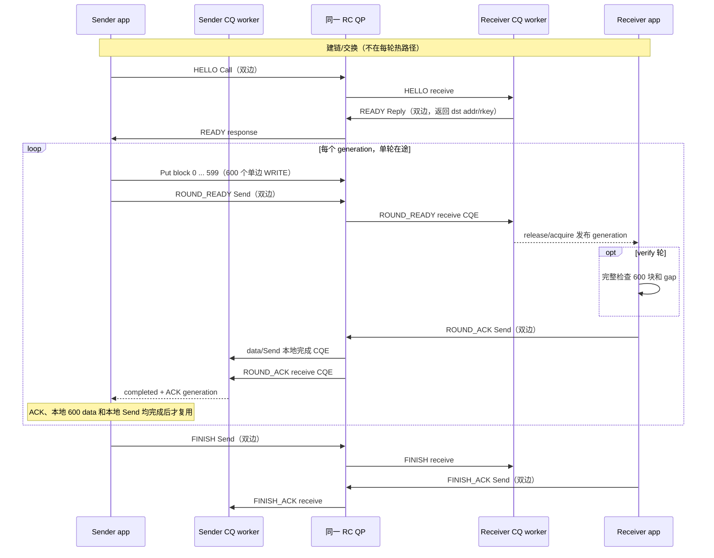
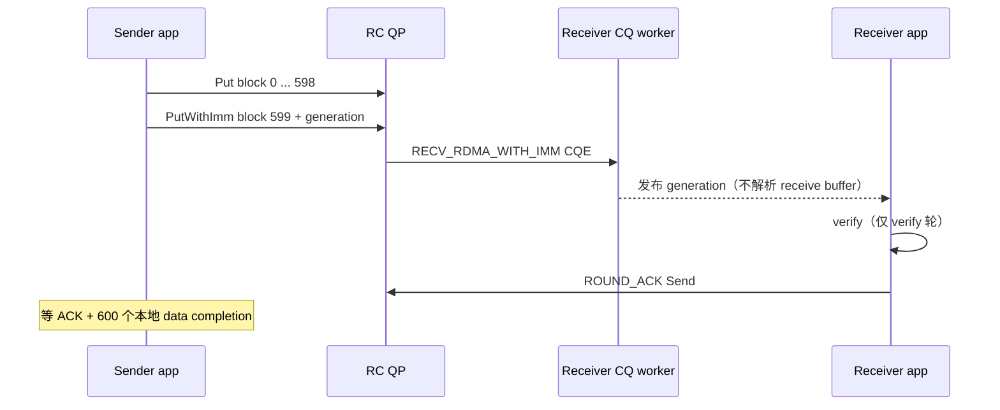
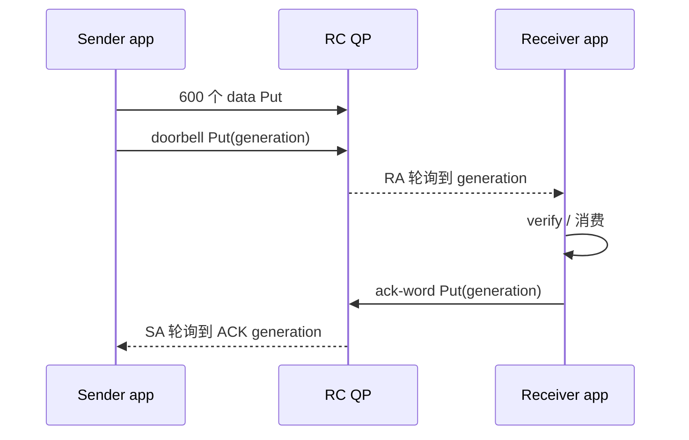

# 旧协议阶段 1.5 实施记录与双边消息分析

日期：2026-09-12

> 适用边界：本文记录 remote（旧 sender）主动传输并计时、接收后回 ROUND_ACK 的旧协议。2026-09-12 新设计已改为 local 请求驱动的 sparse_copy，见 [DESIGN_CN.md](DESIGN_CN.md) 和 [IMPLEMENTATION_PLAN_CN.md](IMPLEMENTATION_PLAN_CN.md)。本报告是历史证据，不是下一阶段的执行指令。
>
> 新协议的阶段1/2 direct每次包含9664字节的600个源/目标地址对，在local计时，逐轮成功ACK=0；下一COPY_REQ代表上一轮消费完成并授予复用权限，remote仍排空自己的callbacks。阶段3若调用方真实提供可展开的聚合源描述符，SGL=30可使用20个source地址加600个destination地址；否则source仍为600个。local只向remote提供dst/staging key，remote source key不导出。下文“ACK不能无条件删除”只适用于当时缺少请求驱动的旧状态机；第5/6节保留ACK、direct最后一笔IMM和门铃实验建议已被新路线替代。A/B的等待和记账优化仍可迁移，旧性能不能直接作新指标对照。

## 1. 结论与状态

阶段 1.5 的 A+B 最小优化已在 `perf_test` 中实现，保持 direct B1 的数据与控制协议不变：每轮仍为 600 个异步 `Put(1024)`、1 个 `ROUND_READY` Send、1 个反向 `ROUND_ACK`，单轮在途，source/destination stride 均为 4096。没有 staging、scatter、SGL、IMM、跨轮窗口或 `ubs-comm` 修改。

初始交付时记为 `IMPLEMENTED / LOCAL_PASS_HW_PENDING`：Windows 本机完成了受限语法检查，当时未执行目标 Linux/AArch64 构建、self-test、错误注入、profile、双机 verify 或 5 次 original/A/AB 对照。后续旧目标机性能摘要保存在第 7 节；它未补齐整套验收证据，也不能据此推断 A/B 加速比例。

## 2. 阶段 1.5 改动

### A：数据面等待

- 新增仅用于数据面的 `WaitData`；sender 的整轮完成、receiver 的 `ROUND_READY` 和 receiver 的 ACK 本地完成使用该路径。
- 每轮入口和退出检查 fatal；spin 中每次检查 fatal 和 acquire 谓词，但只在每 256 次循环后读取一次 deadline。
- AArch64/ARM 使用处理器 `yield` hint，x86 使用 `pause`；这不是 `std::this_thread::yield()`，不会逐次进入 OS 调度器。
- FINISH、FINISH_ACK、建链等待和失败 drain 继续使用有界的控制/非性能等待；断链或无 callback 时不会无限自旋。
- 正式 measure 要求显式指定不同的 app/worker CPU。运行者仍须从机器拓扑确认二者是不同物理核心。

### B：按线程所有权记账

- sender app 线程独占的 Put attempted 计数和 app 发起的 Send attempted 计数改为普通 `uint64_t`，消除 600 次 Put 提交中的逐请求 atomic RMW。
- `READY Reply` 是接收 handler/CQ 线程发起的特殊路径，其 attempted 计数仍为原子变量，不能与 app-owned 计数混写。
- callback-owned 的 data/send completed 与 active callback 计数继续使用原子变量和 release/acquire；`ActiveCallbackGuard` 未删除。
- app-owned 与 callback-owned 计数分别放入 cache-line 对齐的状态组。优先采用 C++17 `hardware_destructive_interference_size`；旧标准库才使用 64 字节回退值，结果 JSON 会记录实际编译取值。
- attempted 在异步 API 调用前更新，保留 callback 早于 API 返回的语义；API 失败后仍进入原有有界 drain，不能假设失败请求必有 callback。
- 每请求 callback 的 `UBSHcomNewCallback` 分配/删除保持不变。只有目标机 profile 证明 allocator 是主要成本后，才能另做安全固定容量复用实验。
- `mSubmitNs` / `mE2eNs` 的 `reserve` 已移到正式 wall 计时开始前；这只是计时边界修正。

## 3. original / A / AB 对照标识

| 版本 | 标识 | 内容 |
|---|---|---|
| original | git `2a14e00`；代码基线亦可追溯到 `0f5e382` | 原始逐次 clock + OS yield、逐 Put 原子 attempted 计数 |
| A | 中间 A-only diff 流 SHA-1 `7834ac29f21720163e667ccdf70d6a329416e105` | 仅等待优化和 measure 绑核约束 |
| AB | 相对 `2a14e00` 的最终 `rdma_600.cpp` diff 流 SHA-1 `36ecc77079e83001f2be2265231c843f4182a5c3` | A + 线程所有权记账、cache-line 隔离、reserve 边界修正和结果元数据 |

上述 A/AB SHA-1 是 `git diff --binary -- rdma_600.cpp | git hash-object --stdin` 的内容标识，不是假装成 git commit。正式跑测应保存原始 diff、源码状态、二进制和静态 hcom 链接输入 hash；不得只依赖该表。

## 4. 旧协议时序

## 5. 旧协议下的双边消息合并分析（历史）

| 消息 | 频率 | 能否精简 | 分析 |
|---|---:|---|---|
| HELLO / READY | 每连接各 1 次 | 不宜消除 | 第一次单边写之前，sender 必须获得 receiver 的远端地址和 rkey，双方还要核对参数。可改由外部/OOB 配置交换，但只是搬走 bootstrap，并未消除交换。它不在每轮热路径。 |
| ROUND_READY | 每轮 1 次 | 最值得合并 | 当前公开 API 只有普通 `Put`，普通 WRITE 不产生远端 receive CQE。若扩展 `PutWithImm`，可让第 600 个数据 Put 使用 WRITE_WITH_IMM；同 QP 顺序使该 CQE 同时成为前 599 个写完成可见的门铃，从而删除额外 Send，前向 WR 从 `600 WRITE + 1 Send` 变为 `599 WRITE + 1 WRITE_WITH_IMM`。 |
| ROUND_ACK | 每轮 1 次 | 不能无条件删除 | ACK 表示 receiver 已看到整轮、verify 轮已校验，并允许 sender 复用唯一 source/destination。当前没有反向数据 WRITE 可供 piggyback。可改成 receiver 对 sender ack word 的普通 Put，但仍需 1 个反向 WR，只是去掉双边接收和消息解析。 |
| FINISH / FINISH_ACK | 每进程各 1 次 | 可研究合并，收益极小 | 总轮数已在 HELLO 中交换，理论上可把最终验证状态并入最后一个 ACK。但当前双向 FINISH 还协调最终扫描、callback drain 和安全 teardown；直接删除可能让一端先 Disconnect，被另一端当作 channel broken。应单独验证，不应混入阶段 1.5 性能收益。 |

### 推荐的第一步：只合并 ROUND_READY

这是唯一同时减少热路径 API 次数和 WR 数的直接方案，但当前 `ubs-comm` 公共接口没有 `PutWithImm`，已有 immediate 路径是 `SEND_WITH_IMM`，不是 RDMA WRITE_WITH_IMM。实现它需要修改库的公共 API、worker/QP 传递、接收 CQ opcode 分流和 RQ 补投，并在两端重编；因此本轮只形成方案，没有越过边界修改 `ubs-comm`。

### 不改库的实验方案：内存门铃

可让 receiver 额外暴露一个 control MR，sender 在 600 个数据 Put 后再 Put 一个 generation doorbell；receiver app 忙轮询该 word。反向 ACK 同理可写 sender 的 ack word。

它可以把每轮双边消息数降到 0，但没有减少 WR：前向仍是 601 个 WR，反向仍是 1 个 WR；同时新增 control MR/key 交换、DMA 内存轮询、缓存一致性与设备可见性验证。若把 generation 嵌入第 600 个数据块可把前向降到 600 WR，但会改变 measure 数据内容并引入每轮源数据更新，已不再是严格相同的 B1 基线。这个方案应作为独立 case，不应覆盖 original/A/AB。

## 6. 当时建议的实验顺序（已被新实施计划替代）

1. 先在目标机完成 original、A、AB 的 20 轮完整 verify 和各 5 次正式测量，确认阶段 1.5 本身的收益与 CPU 代价。
2. 新增独立 `notify=imm-last-put` 实验，且只改 ROUND_READY；保持 ACK、FINISH、600 块 direct 布局和单轮在途。它需要明确授权修改 `ubs-comm`。
3. 若目标是“每轮零双边消息”，再新增 `notify=doorbell-put, ack=doorbell-put` 的独立实验，与 Send/IMM 成对比较。必须记录真实 WR、RQ/CQ、CPU 占用和断链有界退出。
4. 最后才评估将最终状态并入最后 ACK。HELLO/READY 仍建议保留为低频 bootstrap，不为消除两条一次性消息牺牲参数校验和 MR 安全。

## 7. 旧目标机 submit 长尾摘要（从旧设计文档迁存）

旧 DESIGN_CN.md 在 `main@38e6637` 记录了以下后续目标机摘要，现移到历史报告以避免丢失调查线索。这是旧 remote 计时/ACK 协议的数据，不是本次新跑测；本次文档修改未重新核验完整原始日志或补齐各阶段硬件验收。

10000 轮的 `submit_avg/p50/p95/p99` 为 `689.469/460.990/590.800/4617.720 us`，`e2e_avg/p50/p95/p99` 为 `699.652/469.210/599.190/4627.710 us`。临时诊断中 `post_submit_wait` 平均 `10.183 us`；ACK 在 10000 轮中均为最后完成 gate，而完成事件 p99 紧随 submit p99。

当时的判断是毫秒级长尾已经在 600 次 Put 加 ROUND_READY 的提交阶段形成，不能只因 ACK 最后满足就归因于回程 ACK 或末尾 WaitData。若恢复调查，独立诊断提交内部的背压、callback/上下文分配回收、SQ/CQ 资源周期及线程抢占/频率/NUMA；正式测量不保留额外 callback 时钟采样。

新协议仍可能遇到相同的 remote 提交瓶颈，但需要在 local sparse_copy 主计时和独立 remote trace 下重新验证，不能将旧数字直接迁入新结果表。
